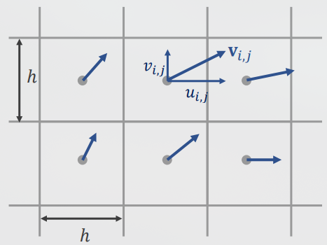
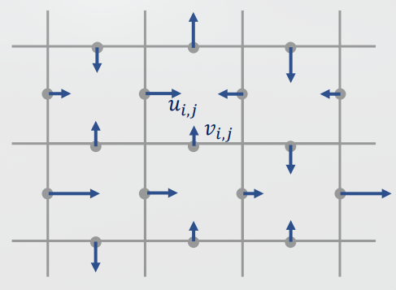
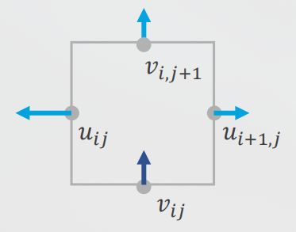
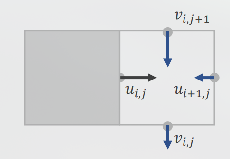
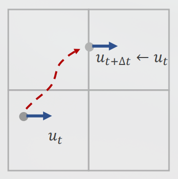
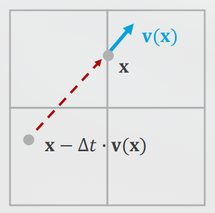
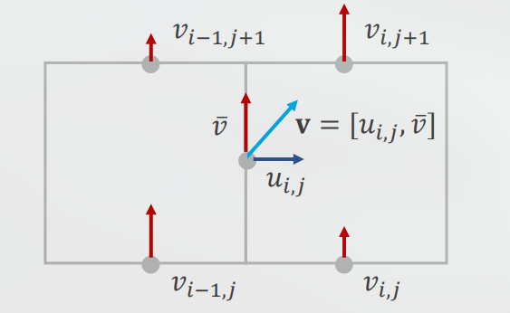
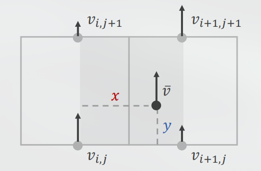
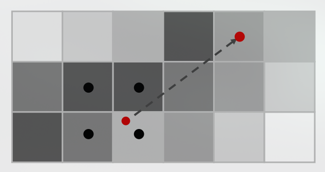

## Introduction

The goal of this project is to simulate the advection in a incompressible fluid space. Advection is defined to be transport of a substance or quantity by bulk motion of a fluid. For example transportation of a drop of ink in water. With this method we can also calculate the pressure field for our simulation which in turn can give us great insight into aerodynamics of an object or help us simulate and analyze the weather.
The term Eulerian refers to the fact that the method we are using models the fluid using a grid, in contrast to the Lagrangian methods which simulates the fluid interaction with the help of particles.
The term fluid can refer both to liquids and gases. In this project we will simulate only incompressible fluids, that is the fluid cannot change density when pressure is applied to it. In most cases we can safely assume that the fluid is in fact incompressible. For example water only compresses 3% when a force of $100,000N$ over $1cm$ is applied to it. Also it is reasonable to assume that free gas is incompressible in most scenarios.
The other assumption that we make is the the fluid has zero viscosity (i.e it has little to no resistance to change shape) much like water.

## Representation of the Fluid

As we have previously discussed we will model the fluid using a grid. The first thing we need to keep track of in our grid is the velocity field, which is a function of position and time. To represent the velocity field, in each cell we can store the velocity vector of the center of it.

Collocated grid

Or we can simplify it by storing the horizontal and vertical part the vectors at the edge of the cells. In this way we can have a really easier way of knowing how much fluid is flowing from a cell to another cell.

Staggered grid

We also need to store the density of the quantity or substance that is moving in the fluid, which is easy since it is just a scalar field. So the only thing we need to do is to keep track of the density of the substance for each grid cell.

## Algorithm

There are three main steps for this algorithm.

1. Modify velocity values
2. Projection (ensures the fluid is incompressible)
3. Advection (moves the velocity vector)

## Modifying the velocity values

In this step we need to modify the velocity values based on external forces. In this project we will just use gravity. This step is quite simple, it's just required to update the vertical velocity using this formula.

$$
v_{i,j} \leftarrow v_{i,j} + \Delta t \cdot g \\
$$
$$
g=-9.81m/s^2
$$

## Projection

In the realm of incompressible fluids there a rule that ensures the flow of the fluid is in such a way that the fluid remains incompressible. That is the divergence of the velocity filed should remain 0.

$$
\nabla \cdot \bf v = 0
$$

This basically states that if an amount of fluid is entering a cell the same amount should exit it, since divergence is proportional to the amount of fluid that exits the cell.
For our discretized problem we can calculate the divergence like so.

$$
d \leftarrow u_{i+1,j} - u_{i,j} + v_{i,j+1} - v_{i,j}
$$

To set the divergence to 0 we modify each velocity by the same value.

$$
\begin{aligned}
&u_{i,j} \leftarrow u_{i,j} + \frac{d}{4} \\
&u_{i+1,j} \leftarrow u_{i+1,j} - \frac{d}{4} \\
&v_{i,j} \leftarrow v_{i,j} + \frac{d}{4} \\
&v_{i,j+1} \leftarrow v_{i,j+1} - \frac{d}{4} \\
\end{aligned}
$$

In the edge cases where there is a wall next to the cell we can apply Projection the same way.

$$
\begin{aligned}
&u_{i+1,j} \leftarrow u_{i+1,j} - \frac{d}{3} \\
&v_{i,j} \leftarrow v_{i,j} + \frac{d}{3} \\
&v_{i,j+1} \leftarrow v_{i,j+1} - \frac{d}{3} \\
\end{aligned}
$$

For each cell we should also store a flag that determines whether it's a wall or not. $s=0$ for walls and $s=1$ for fluid cells. Projection can be solved for the general case with the following algorithm. This method is called the Gauss-Seidel method.

$$
\begin{aligned}
&s \leftarrow s_{i+1,j} + s_{i-1,j} + s_{i,j+1} + s_{i,j-1} \\
&u_{i,j} \leftarrow u_{i,j} + \frac{s_{i-1,j}d}{s} \\
&u_{i+1,j} \leftarrow u_{i+1,j} - \frac{s_{i+1,j}d}{s} \\
&v_{i,j} \leftarrow v_{i,j} + \frac{s_{i,j-1}d}{s} \\
&v_{i,j+1} \leftarrow v_{i,j+1} - \frac{s_{i,j+1}d}{s} \\
\end{aligned}
$$

But now we need to apply these rules to all the cells in our simulation. Unfortunately this methods takes a lot of iterations to converge but we can use a very simple trick called overrelaxation to combat it. To do so we only need to multiply the divergence by some constant between 1 and 2 when calculating it.

$$
d \leftarrow o(u_{i+1,j} - u_{i,j} + v_{i,j+1} - v_{i,j})
$$

$$
1 < o < 2
$$

## Additional Information

It's possible to calculate the pressure for a given cell. This step is not necessary for the actual simulation but can give us additional information and a better insight into our simulation. To calculate the pressure for the cells, for the first step we need to set the pressure for all cells to zero. Then apply the following algorithm for each cell.

$for$ $all$ $i,j$
 $p_{i,j}\leftarrow 0$
$for$ $n$ $iterations$
 $for$ $all$ $i,j$
  $p_{i,j}\leftarrow p_{i,j}+\frac{d}{s}\cdot \frac{\rho h}{\Delta t}$

$p_{i,j}$ is pressure
$\rho$ density
$h$ grid spacing
$\Delta t$ time step

## Advection

In our fluid the velocity state is carried by the particles but we are storing the velocity in the grid itself. Therefor we need to update the velocity at each iteration. To solve the Advection problem we will be using a method called Semi-Lagrangian advection since it will solve advection with the help of particles.

The first step of the algorithm is to ask where was the fluid particle where $u$ is stored in the previous iteration. And then update $u$ to the horizontal velocity of said particle at the previous step.
To find that particle we can calculate the velocity vector at $\bf x$ where $u$ is stored. Then we can approximate the previous location of that particle with this formula.

$$
\bf x - \Delta t \cdot \bf v(x)
$$

We have the horizontal part of $\bf v(x)$ but how can we find the vertical part of it? Simple we can estimate it by averaging the surrounding vertical velocities.

$$
\bar v = (v_{i,j} + v_{i,j+} + v_{i-1,j} + v_{i-1,j+1}) / 4
$$

After finding the position of the particle we now we have to find the particle's velocity. To compute the velocity for a general position we can use this formula.

$$
\begin{align}
&w_{00} = 1 - \frac{x}{h} \\
&w_{10} = 1 - \frac{y}{h} \\
&w_{01} = \frac{x}{h} \\
&w_{11} = \frac{y}{h} \\
\end{align}
$$

$$
\bar v = w_{00}w_{10}v_{i,j} + w_{01}w_{10}v_{i+1,j} + w_{01}w_{11}v_{i,j+1} + w_{00}w_{11}v_{i+1,j+1}
$$

Now the only thing left to do is to move the smoke in or the quantity through the fluid. We can a take similar approach and find the previous position of the particle that is at the center of the cell. Then calculate the new intensity by interpolating using the four nearest points by a weighted average.

